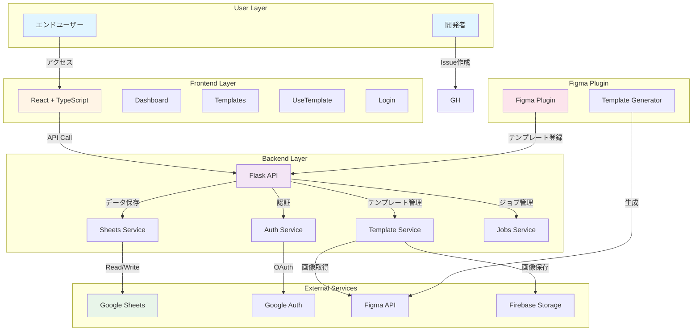
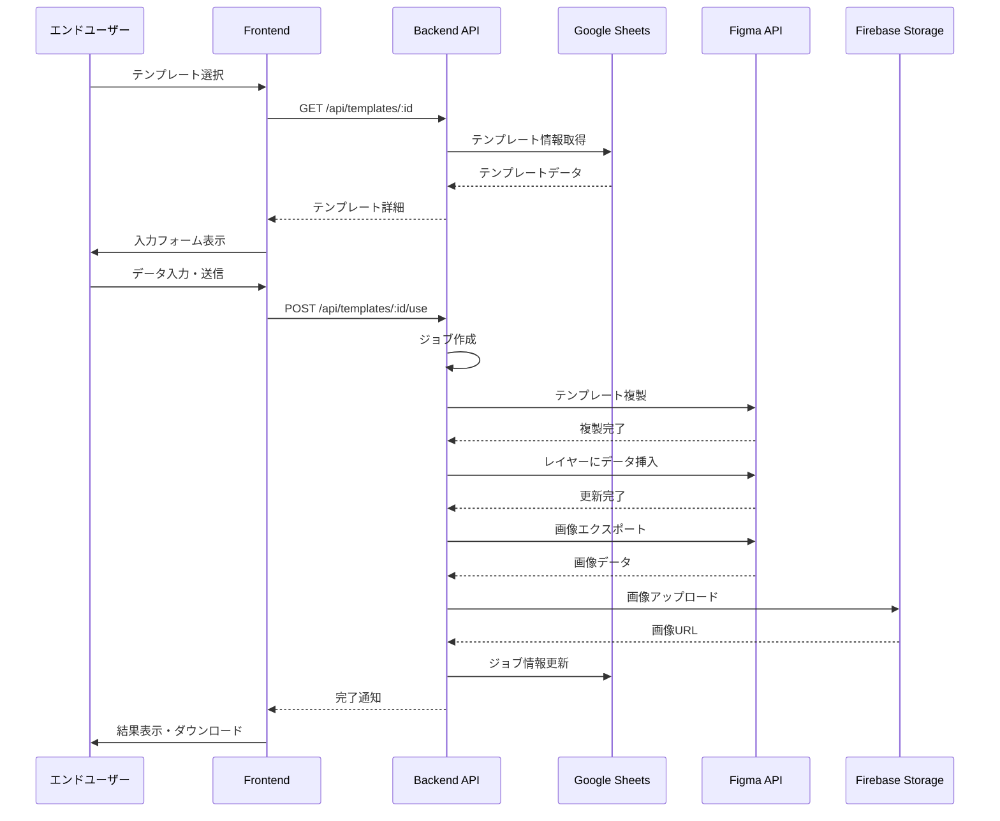
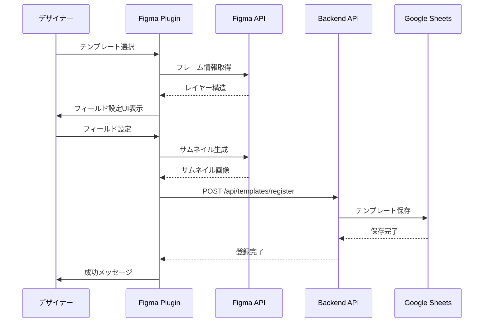
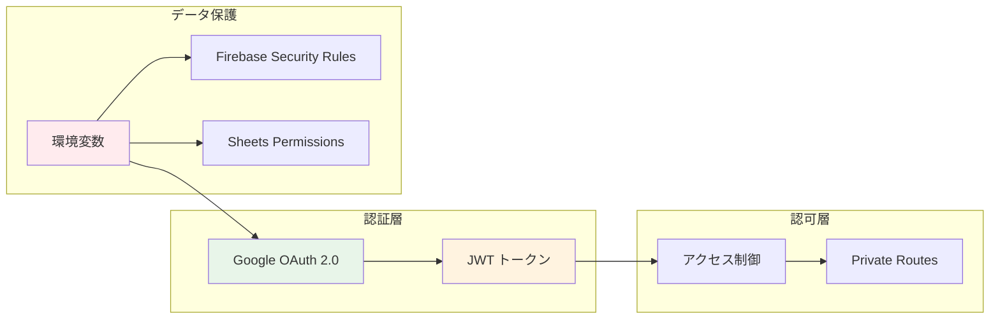
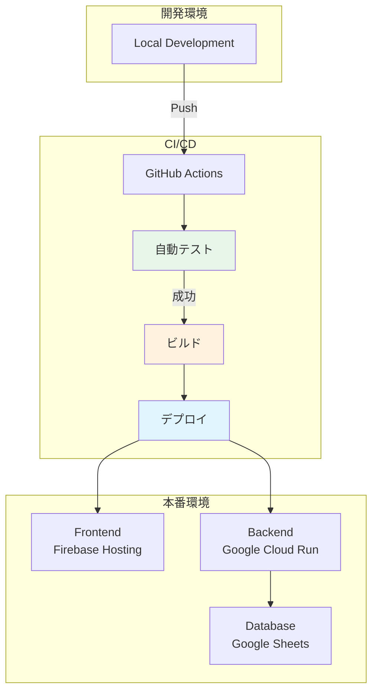
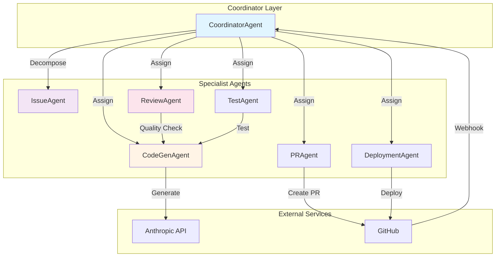
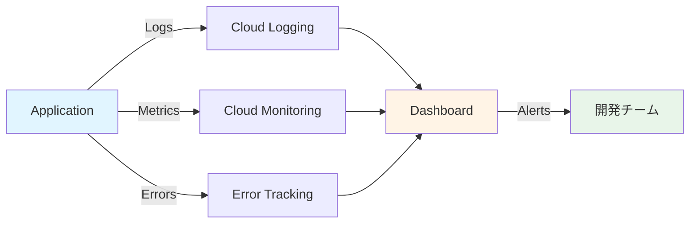

# アーキテクチャドキュメント

## システム構成図



## データフロー図

### テンプレート使用フロー



### Figmaプラグイン登録フロー



## コンポーネント構成

### Frontend (React)

```
frontend/src/
├── pages/
│   ├── Login.tsx          # 認証画面
│   ├── Dashboard.tsx      # ダッシュボード
│   ├── Templates.tsx      # テンプレート一覧
│   └── UseTemplate.tsx    # テンプレート使用画面
├── components/
│   ├── PrivateRoute.tsx   # 認証ルート
│   └── TemplateDetailModal.tsx  # 詳細モーダル
├── utils/
│   └── auth.ts            # 認証ユーティリティ
├── App.tsx                # メインアプリ
└── main.tsx               # エントリーポイント
```

### Backend (Flask)

```
backend/
├── app.py                 # メインアプリケーション
├── api/
│   └── jobs.py           # ジョブAPI（非同期処理）
└── services/
    └── sheets.py         # Google Sheets連携
```

### Figma Plugin

```
figma-plugin/
├── code.ts               # プラグインロジック
└── ui.html               # プラグインUI
```

## 技術スタック

### Frontend
- **React 18** - UIフレームワーク
- **TypeScript** - 型安全
- **Vite** - ビルドツール
- **TailwindCSS** - スタイリング
- **React Router** - ルーティング
- **Vitest** - テストフレームワーク
- **React Testing Library** - コンポーネントテスト

### Backend
- **Flask** - Pythonウェブフレームワーク
- **Google API Client** - Google連携
- **Firebase Admin SDK** - Firebase連携

### DevOps & CI/CD
- **GitHub Actions** - 26+ ワークフロー
- **Miyabi Framework** - 自律型開発環境
- **7 AI Agents** - 自動化エージェント

## セキュリティアーキテクチャ



### セキュリティ対策

1. **認証**
   - Google OAuth 2.0による認証
   - JWTトークンでセッション管理
   - トークンの有効期限管理

2. **認可**
   - Private Routeによるページアクセス制御
   - APIエンドポイントの認証チェック

3. **データ保護**
   - 環境変数で機密情報管理
   - `.env`ファイルを`.gitignore`に含める
   - Firebase Security Rulesによるストレージ保護
   - Google Sheetsのアクセス権限管理

4. **通信**
   - HTTPS通信必須
   - CORSポリシー設定

## デプロイメント構成



## Miyabi Agentアーキテクチャ



## パフォーマンス最適化

### Frontend
- **Code Splitting** - ルート単位での分割
- **Lazy Loading** - 画像の遅延読み込み
- **Memoization** - React.memoによる再レンダリング防止
- **Virtual Scrolling** - 長いリストの仮想化

### Backend
- **非同期処理** - ジョブキューで重い処理を分離
- **キャッシング** - Sheets APIのレスポンスキャッシュ
- **バッチ処理** - 複数リクエストの一括処理

### Network
- **CDN** - Firebase Hostingによる配信
- **圧縮** - gzip/brotli圧縮
- **HTTP/2** - マルチプレクシング

## モニタリング



### 監視項目
- **可用性** - アップタイム監視
- **パフォーマンス** - レスポンスタイム
- **エラー率** - HTTP 5xx エラー
- **使用率** - API呼び出し回数
- **ユーザー数** - アクティブユーザー

## スケーラビリティ

### 水平スケーリング
- Firebase Hostingの自動スケール
- Cloud Runのオートスケーリング

### 垂直スケーリング
- インスタンスサイズの調整
- メモリ・CPUの増強

### データベース
- Google Sheetsの読み取りキャッシュ
- 将来的にCloud Firestoreへの移行検討

---

📐 このドキュメントはプロジェクトの成長と共に更新されます。
